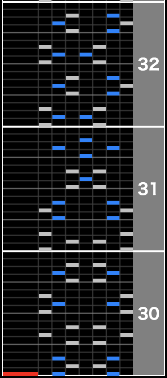
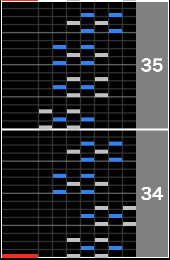
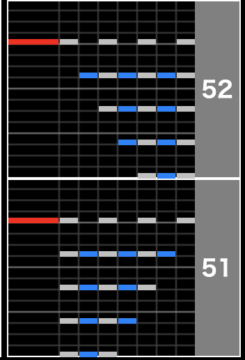
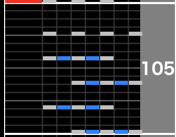
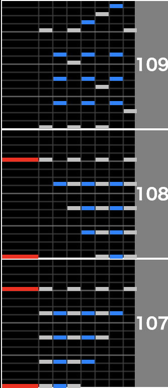
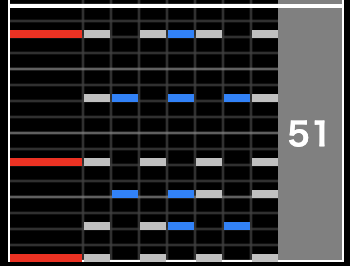
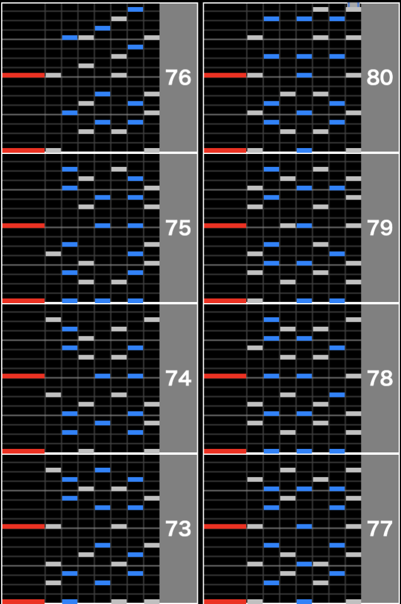
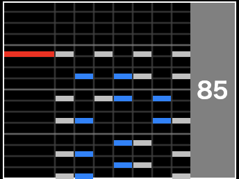
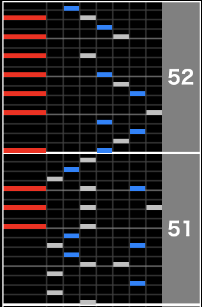
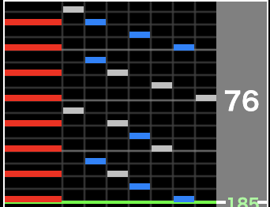

どうもヒロです！梅雨が明けたら連日の33度、34度などの猛暑で少し外に出るだけでヘトヘトになってしまう今日この頃、皆様いかがお過ごしでしょうか？

明日からとうとう東京オリンピック2020が始まります。東京の感染者数が増えていたり、日本だけじゃなく各国増加しているというニュースなどを見ると色々考えさせられますね。

さてさて、今回はタイトルの通り、AC九段に受かりましたので、その事について書いて行きたいと思います！

## AC九段に受かった話

タイトルの通りですが、本日AC九段に受かりました！

https://twitter.com/hirodeath/status/1418030401608589313?s=20

## 段位年表

**2020年**  
4月19日: infinitas1級合格  
4月22日: infinitas初段合格  
5月13日: infinitas二段合格  
5月19日: infinitas三段合格  
5月28日: infinitas四段合格  
5月28日: AC/HV 二段合格  
5月28日: AC/HV 三段合格  
6月30日: AC/HV 五段合格(四段飛び級)  
7月22日: infinitas六段合格(多分infinitas五段は飛び級？)  
7月23日: AC/HV 六段合格  
12月29日: AC/ビストロ 七段合格  
**2021年**  
4月24日: AC/ビストロ八段合格  
5月27日: infintias八段合格  
7月22日: AC/ビストロ九段合格 ← NEW!

八段受かってから大体3ヶ月ぐらいかかっていますね。七段→八段よりも八段→九段の方が時間かかると思っていたのですが、そうでもなかったです。

ちなみに十段記念受験しましたが、、、

https://twitter.com/hirodeath/status/1418035817159610370?s=20

全く押せませんでした。4個同時押しの8分ラッシュが全く押せなかったのでもっと地力を上げる必要があると思いました。

## 九段段位楽曲解説

ここからは個人的九段楽曲攻略の解説をしていこうと思います。

ビストロ九段の段位楽曲は以下の通りです。

- Override(A/☆11)
- BroGamer(A/☆11)
- ALBA -黎明-(A/☆11)
- 少年A(A/☆12)

### Override

Overrideはこの課題曲の中では比較的易しい難易度だと思います。個人的に難しいと思ったのはこの2箇所と終盤の皿複合が増える箇所です。

リズムとしてはタタタッ、タタタッっという感じの3連地帯になっていますが、右手左手で交互に3連を取る事が出来ず、ほぼ全部を両手で捌く事になります。簡易デニムみたいな地帯は特に押し辛く、この35小節目以降回復出来るので耐え凌げば良いという感じですが、この地帯は未だに難しく感じます。

### BroGamer

BroGamerは九段受けたての頃、普通にゲージ落ちしていました。というのも中盤(here is the battleの直後)の皿複合同時が押せずに、ゲージが低空飛行して最後の同時でゲージが消し飛んでいました。

個人的に辛かったのは下記3箇所です

51-52小節に関しては全押しすれば良いのでは？とか1つずつ増えていくんだからそんなに難しくないと頭で思っていてもやってみると全然光らず、ゲージ削られる事が本当に多かったです。ただ中盤はそこを乗り切れば最後まで回復出来るので良いですが、その後の終盤地帯105小節目と107-109小節目が鬼門でした。

まず105小節目は配置を認識してちゃんと押す、が出来ませんした。なので全押しか誤魔化して何となく押すで対処しました。ここでゲージ吹っ飛んで107-108小節目でさらにゲージ吹っ飛ばし、109小節目の微妙に難しい配置でゲージ落ちかゲージ6%などでALBAに到達みたいな事がしょっちゅうありました。なので九段において、皿複合と3つ以上の同時押しをどれだけちゃんと捌けるかが鬼門になってきます。

### ALBA -黎明-

はい。九段の個人的最難関です。ここをちゃんと抜けれる地力があれば正直九段受かったようなもんだと思います。ちなみに僕はALBAを抜けたのはたった2回しかありません。それくらいいつもいつも何回もALBAでゲージ落ちしていました。個人的難所の解説をします。

まず、「革命を今」の後のCNラッシュはCN慣れてないとゲージ削れますが、九段受かるまでにはこれぐらいのCNを捌く力は必須だと思います。目安としてはAlmagest SPHをアシストイージー出来るくらい押せればALBAのCNも押せると思います。もう少し簡単な所だとParticle Arts(A/☆10)なども良い練習譜面になると思います。BMS環境ある人はLN難易度表の◆3-5ぐらいの難易度をやると良いと思います。

個人的難所は以下です。

まず「革命を今」と歌唱している箇所の51小節目、九段課題曲に4つ同時押し + 皿の複合入れるの本当にやめて欲しいですが、3連などではなく8分で同時が入ってきます。正直九段受けたての頃はここで何回かゲージ落ちしました。慣れるまではここの同時とこの直後のCN地帯が鬼門になります。しかしこことCN地帯突破しても終盤の73小節から80小説にかけて地獄の2つ以上同時押し16分5連打が地帯が長々とあります。

正直ここが九段最大の鬼門と言っても過言ではないと思います。僕も何度も何度もゲージ落ちし、泣かされて来ました。これを押せるようになる為には単純に地力を上げるしかないと思います。そしてここを抜けても最後の最後にめちゃくちゃ押しつらい85小節目のような単音なんて配置してたまるかのエリアがあります。ここでゲージ落ちも何回も経験しました。

とにかくALBAは難しい。救いがあるとすればALBAは地力譜面よりだと思うので純粋に地力を上げて殴れば突破出来る譜面、という事です。the safariみたいに地力上がっても67トリル押せません、だからサファリ難民抜けられないみたいな事はないと思います。純粋に地力を上げて殴るのが正攻法だと思います。

### 少年A

上述した通り、僕は少年Aに到達したのはたったの2回です。そして2回目で少年A突破しています。なのでALBA抜けたら九段ほぼ合格、と言いたい所ですが人によって得意不得意があると思うので、個人的にここ難しかったかもと思う箇所を書きます。

まず開幕低速地帯、ここのギアチェン失敗するとゲージ落ちします。僕はギアチェン苦手なのでスタートボタン押して緑数字を一旦下げて直ぐに戻すで速度変化を対応していました。幸い少年Aの低速→高速までの間に間があるので慣れれば速度変化失敗となる事は少ないと思います。

少年Aは何が難しいか？というと下記2箇所が純粋に押し辛かったです。

はい、皿複合です。皿の枚数が多いのに鍵盤もそれなりにあるのでここでゲージを落とし易いです。初めてALBA抜けて少年A挑戦した時も51-52小節目、76小節目でガッツリ削られてゲージ落ちしました。

ただ道中はそんなに難しくないと個人的には思うので道中ゲージ残しながら皿の枚数が多くなる箇所でひたすら頑張れば少年Aはそんなにキツくないと思います。

### 九段総評

九段は地力ゲーです。なのでステップアップで段位練習、ALBAゲージ100%スタートで抜けられれば九段突破の可能性はあると思って大丈夫だと思います。逆にステップアップでALBAゲージ100%スタートで抜けられないなら純粋に地力が足りない可能性があるので、時々段位に挑戦する、基本地力上げで良いと思います。八段4曲目のs!ckを段位ゲージで抜けられる地力があるのならベースはあると思うのであとはひたすら☆10-11をやるだけで地力は上がると思います。

BMS環境ある人はsatellite sl0-1、或いは第二発狂▼0-1をひたすらやるだけで地力上がると思います。

皿複合が苦手意識あった自分としては皿複合が辛いs!ckを克服するより純粋に地力で戦えるALBAの方が戦いやすかったです。メンタル的に。

## 十段に向けて

十段に向けて何をするか？というのはざっくり決めたのですが、まずはinfinitas、BMS、ACの各3種ランプ埋めをやって行こうと思います。隙あらば☆12をトライしつつ、自分が出来るギリギリの譜面を出来る限り毎日やって少しずつ地力上げて行きたいです。

九段受かったものの、まだ☆12は全く押せないのでもっと押せるようになりたい、、、けどとにかくここからは時間かかりそうなのでマイペースにやって行きたいと思います。

## 最後に

気合入れて色々書いてしまいましたが、七段、八段受かった直後は心臓バクバクでやばい！受かった！という気持ちでいっぱいでしたが、何故か九段受かった直後は案外冷静でした。腹痛だったから気が紛れのかもですが、それでもついにやってやった！という気持ちは強いです！ここからさらに気を引き締めて皆伝まで上り詰めたいです！

また頑張るぞ！！！
