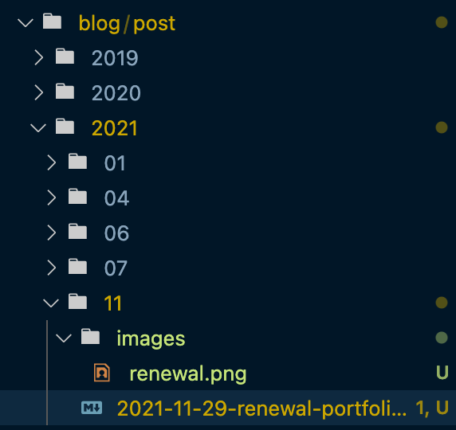

どうもヒロです！もうすっかり年末ですが、皆さん如何お過ごしでしょうか？

月日が流れるのはあっという間な物で、もうあと数日で2021年が終わります。早すぎますね。

今回はいくつか散らばっていたブログサイトを一つにまとめた話しです。それでは早速ですが行ってみましょう！

## ポートフォリオをgatsbyjs製でリニューアルしました

以前からあった、技術系同人サークル、もふもふ☆パラダイス(以下もふパラ)と僕のポートフォリオサイトと個人的なブログサイトを一つにドメインにまとめて作り直しました。

もふパラのサイトはgulpでhtmlを生成し、前ポートフォリオサイトはreact + webpackで作られ、僕の個人的なブログサイトはwordpressで作られていました。

何故こんなに作りがとっ散らかっていたかというと、最初にもふパラサイトを作った時はwordpressで作っていました。ブログサイトも兼ねてwordpressで作っていましたが、どうもPHPを書きたくなく、全てjavascriptで管理したい、という気持ちがあり、良いテンプレートエンジンは無いか、、、という選択肢の中の一つがgulpでした。

その次に自分のポートフォリオを作った時、webpackでも静的html生成して作れるじゃん、と当たり前の事に気付き、reactでbody内のdivタグの中に表示する内容を作り、HtmlWebpackPluginを使ってそれ以外に必要なhtmlの内容を生成するようにしました。

しかし、その当時gatsbyjsのような便利な静的htmlを生成するテンプレートが存在せず(もしかしたらあったかもですが)、スクラッチで作っていました。

時は流れ2019年、実は2019年の春ぐらいから2021年の夏ぐらいまでエンジニアとしてのモチベーションがかなり低い時期でした。

そこでなんとなく自分のブログサイトなかったし、作ってみるか、折角ならエンジニア関連の事以外の内容を書くブログを作ろうとwordpressでブログサイトを開設しました。

というのも、エンジニア関連のアウトプット先として

- medium
- dev.to
- qiita

というプラットフォームを使っていて、わざわざ自分のブログで展開する必要は無いだろうと考えていました。
あと、極端にエンジニアとしてのモチベーションが低かったのもありました。

### リニューアルに至った決めて

そして時は流れる事2021年秋、そろそろちゃんとポートフォリオを作り直したいし、なんならブログサイトももふパラサイトも統一させたいと思い、作り直しを始めました。

技術選定に関してはgatsbyjsでwordpressからの乗り換えの記事を度々見かける事があり、以前からもし作り直すならgatsbyjsだろうと決めていたのもあり、すぐにgatsbyjsの環境を用意し、作り直し始めました。

### ハマった所

正直ハマりまくりました。もしかして自分のやり方が悪い？皆こんなもんなの？と疑心暗鬼になるぐらいハマりました。とはいえ一番ハマったのはwordpressのコンテンツをmarkdownに変換する時の話しです。

#### wordpressのコンテンツをmarkdownに変換するのに苦戦した

今回、wordpress-export-to-markdownというライブラリを使いました。このライブラリのお陰で以下のような構造でmarkdownファイルとそれに使用した画像のファイルを保持する事が出来ます。

しかし、そのままの設定だとのパスがサムネイル画像(coverImage)のパスが相対パスではなく絶対パス指定になっていて、graphqlからcoverImageのデータを上手く取得する事が出来ず、悩みに悩んで結局手動で絶対パスから相対パスに変更しました。

それ以外はwordpress-export-to-markdownからexportしたmarkdownのファイルを使って個別記事ページを作る事が出来ました。

個別記事記事内容の下に次の記事と前の記事を表示するエリアがありますが、これらの必要なデータもprevとnextを使ってデータを取得出来たりなど、かなり使い易いAPIデザインをしているなと思いました。

### 今後の課題

細かい課題としては色々あるのですが、ブログサイトで通っていたadsenseが通らなくなってしまったのと画像の読み込みが重く、特にブログトップページを開いた時にページロードが重たいのが気になっています。

他にももふパラページの拡充やポートフォリオの英語訳、ブログページの細かい修正などやりたい事は色々あります。少しずつ改善を加えて良くして行きたいです。

## 最後に

今回リニューアル後、markdownで記事を書いてみましたが、やっぱりmarkdownは書きやすいですね。今後は積極的に些細な事でも良いのでメモ代わりにマメに更新して行きたいと思います。この言葉が嘘にならないように、頑張ります。笑