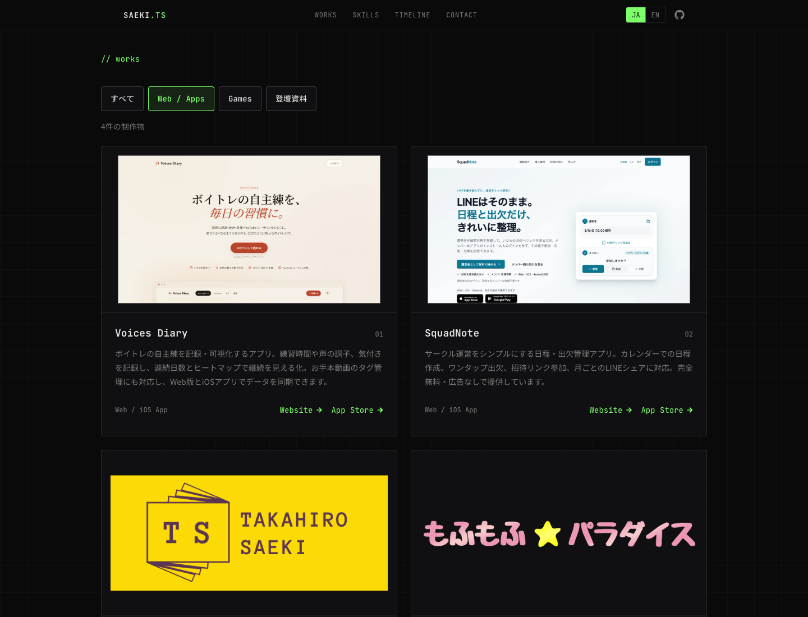
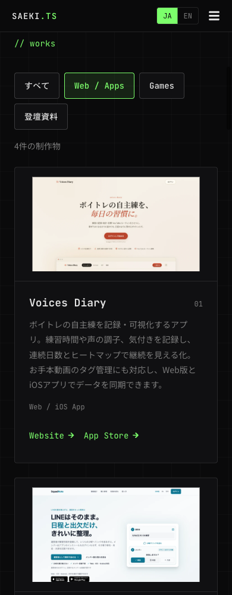
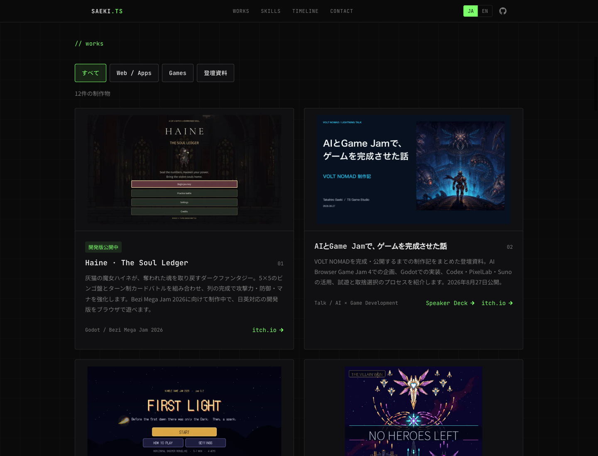
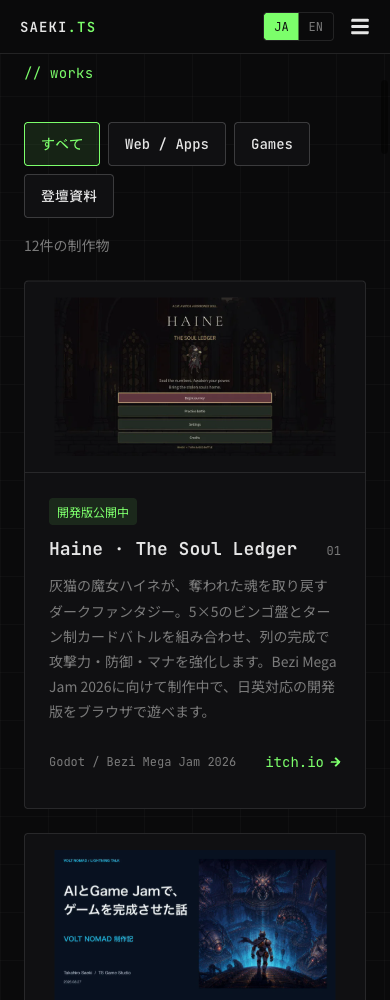
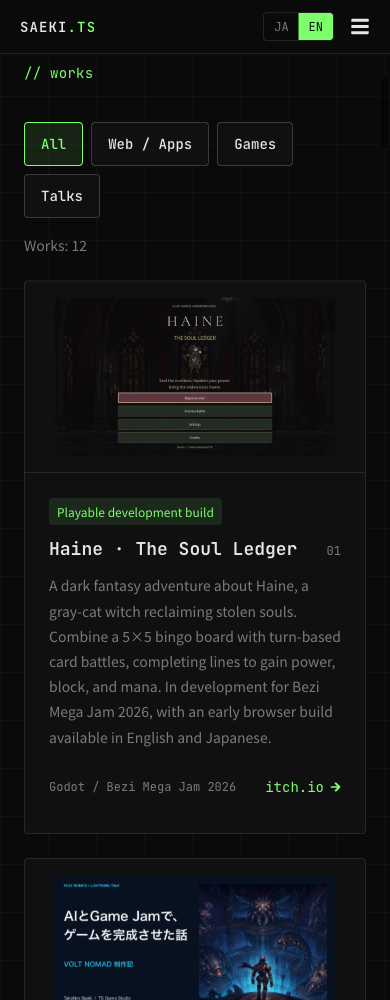
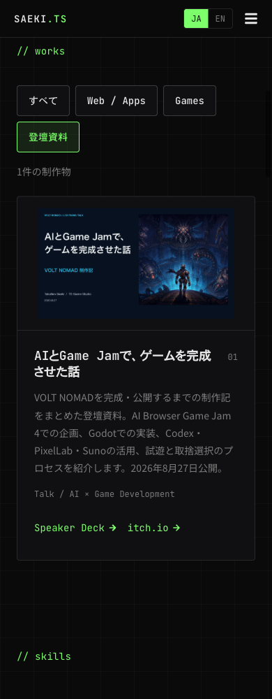

# 制作物一覧と登壇資料

- 機能ID: `portfolio-works`
- 目的: 訪問者が制作物の内容を知り、ゲームや公開資料へ移動できるようにする。
- 最終確認日: 2026-09-19（JST）
- 確認したコード: `codex/portfolio-works-refresh` / `origin/main` の `80c8166` を基準とした公開準備差分。
- 関連チケット: なし。公開用PRは作成後に配信記録へ追記する。
- Plane: `plane_personal` のプロジェクト全6件を照合したが、当リポジトリに対応するプロジェクトは確認できず、未同期。投稿予定本文は [plane-draft.html](plane-draft.html)。

## ローカル版でできること

- トップページの Works（`/#contents`）に12件を掲載する。内訳は Web / Apps 4件、Games 7件、登壇資料1件。
- 「すべて」「Web / Apps」「Games」「登壇資料」で絞り込み、表示件数を確認できる。
- 先頭に Bezi Mega Jam 向けの Haine、その次に VOLT NOMAD の登壇資料を置く。続いて今回追加したゲームを表示し、従来の制作物も保持する。
- Haine は「開発版公開中」と表示する。Jamへの正式提出・完成を意味しない。
- 登壇資料カードから Speaker Deck とゲームを開ける。VOLT NOMAD のゲームカードからも登壇資料へ移動できる。
- 日本語・英語に対応する。切り替えても選択中のカテゴリを維持する。資料の正式タイトルは英語表示でも日本語のまま、説明に日本語の資料であることを記載する。
- モバイルは1列、デスクトップは2列。フィルターボタンは折り返す。ボタン・作品リンクは高さ44px以上で、キーボードフォーカスを表示する。
- フィルターに `aria-pressed`、件数に `aria-live`、作品に `article` と見出しを使用する。外部リンクは別タブで開き、`noopener noreferrer` を設定する。
- カバーはローカルの WebP を遅延読み込みする。16:9の領域を確保し、画像全体を表示する。
- Voices DiaryとSquadNoteのカードには、それぞれの公開トップ画面を撮影したスクリーンショットを日英共通で表示する。
- 共通 `useReveal` は動きの低減時に `opacity: 1` / `y: 0` を明示する。SSRで設定された透明な初期状態が残る問題を修正した。

## 追加した掲載内容と根拠

2026-09-19に以下の公開ページを確認した。制作物の公開状態とポートフォリオの配信状態は別に管理する。

| 制作物 | 掲載内容 | 確認元 |
|---|---|---|
| Haine · The Soul Ledger | 灰猫の魔女、5×5ビンゴ×ターン制カードバトル、Bezi Mega Jam 2026向けの開発版 | [itch.io](https://tsgamestudio.itch.io/haine-the-soul-ledger) |
| AIとGame Jamで、ゲームを完成させた話 | VOLT NOMADの制作過程、Codex・PixelLab・Sunoの活用。2026-08-27公開 | [Speaker Deck](https://speakerdeck.com/takahirosaeki/ai-to-game-jam-de-gemu-o-kansei-saseta-hanashi) |
| First Light | 48時間で制作した横スクロールシューティング・ローグライク、Nimble Game Jam 2026 | [itch.io](https://tsgamestudio.itch.io/first-light) |
| NO HEROES LEFT | 3機体・全5ステージの縦スクロール弾幕ローグライト、Week Sauce、5言語対応 | [itch.io](https://tsgamestudio.itch.io/no-heroes-left) |
| PRIMAL COUNTDOWN | 恐竜の群れを90秒しのぎT-Rexから逃げる短編アクション、Micro Jam 063 | [itch.io](https://tsgamestudio.itch.io/primal-countdown) |

既存の未コミット差分にあった VOLT NOMAD の紹介を掲載対象として取り込み、カバーと資料へのリンクを追加した。プロフィール・フッター更新とモーション実験ページは今回の公開差分には含めていない。

## カバー画像の出典

保存先は `public/images/works/`。ユーザーの既存作品素材をWebPへ変換し、追加の生成素材は使用していない。

- Haine、NO HEROES LEFT、PRIMAL COUNTDOWN、VOLT NOMAD、Roll for Six、LOOP HAXE: 各作品のitch.io公開ページの `og:image`。
- First Light: 同じ個人リポジトリ `nimble-game-jam-2026/build/itch/cover_960x540.png` の提出用カバー。
- 登壇資料: [Speaker Deckの表紙](https://files.speakerdeck.com/presentations/7ab7a0b2e373497897b8c66283a0e3e7/slide_0.jpg)。
- Voices Diary / SquadNote: 2026-09-19、macOS / Chromium / 1440×810で未ログインの公開トップ画面を撮影。撮影元は [Voices Diary](https://voicesdiary.com/) と [SquadNote](https://squad-note.com/)。公開サイトのコード版は未確認。認証後の個人データは含まない。SquadNoteのアクセス解析同意バナーは「同意しない」で閉じている。
- 撮影元PNGは [Voices Diary](assets/voicesdiary-home-source.png) / [SquadNote](assets/squadnote-home-source.png)。掲載用は1200×675のWebP（それぞれ約32 KiB / 52 KiB）に変換。
- 画像ファイル10点、合計約415 KiB。ゲームは幅800px以内、資料は幅1000px以内、公開トップ画面は幅1200px。全12カードに画像がある。

## 実装・検証・配信

| 対象 | 実装 | 検証 | 配信・利用条件 |
|---|---|---|---|
| Web local | `codex/portfolio-works-refresh` に実装 | Lint・TypeScript・静的ビルド成功。実ブラウザ確認済み | `out/` をローカルHTTPサーバーで確認 |
| Web production | 今回の変更は未反映 | 未確認 | push・デプロイは実施していない |
| iOS / Android アプリ | 対象外 | 対象外 | ネイティブ実装はない。モバイル幅はWebとして確認 |

検証内容:

- `npm run lint`、`npx tsc --noEmit`、`npm run build`。最終ビルド内のTypeScript検証も成功。
- Chromium / macOS、1440×1100と390×1000。日英の表示、横はみ出しなし。
- カテゴリ件数: 全件12、Web / Apps 4、Games 7、登壇資料1。
- 言語切り替え後もフィルターを維持し、`html lang`・URLの `lang` パラメーター・文言が更新される。
- キーボードのEnterでカテゴリを選択し、TabでSpeaker Deckのリンクへ移動できる。
- 動きを減らす設定で再読み込み後の全12カードの `opacity` が1であることを確認。通常設定の出現アニメーションも確認。
- 公開資料へのhref、外部リンク属性、全カバー画像の読み込みを確認。
- 公開トップ画面の追加後に静的ビルドとTypeScript検証を再実行し成功。PC・モバイル幅で両画像が読み込まれることと、英語に切り替えても同じ画像を表示することを確認。

## 画面

以下は全て **local / macOS / Playwright Chromium（実ブラウザ、モバイル幅はエミュレーション）/ 2026-09-19 / `main`・`ae9de2e` + 未コミット差分** の実画面。ポートフォリオ本番の配信証明ではない。

### Web / Apps / PC / 日本語

公開トップ画面を追加したVoices DiaryとSquadNote。1440×1100、動きを減らす設定で撮影。

### Web / Apps / モバイル幅 / 日本語

390×1000、動きを減らす設定で撮影。

### Works / PC / 日本語

Haineと登壇資料を先頭に掲載。通常のアニメーション設定で撮影。

### Works / モバイル幅 / 日本語

折り返すカテゴリボタンとHaineの開発版表示。動きを減らす設定で撮影。

### Works / モバイル幅 / 英語

### 登壇資料の絞り込み / モバイル幅 / 日本語

## 公開準備

2026-09-19、ユーザーが本番反映を承認。最新のmain（80c8166）の依存関係で検証後、GitHub Pagesへ反映する。下記の本番未反映状態は配信前時点の記録で、実際の配信結果は完了後に追記する。

## 残作業・制限

- 本番への反映は未実施。
- Planeの対応プロジェクトが未確認のため、機能一覧・本文・画像は未同期。新規プロジェクトや別Wikiは作成していない。
- iOS Safari / Android Chrome の実機確認は未実施。
- 制作物の情報は日英JSONで管理し、itch.io等からの自動同期は行わない。
- カテゴリ選択はリロードで初期化する。URLに保存するのは既存仕様の言語だけ。
- Haineは開発版として掲載し、Jam提出・完成の更新は根拠を再確認して行う。

## 更新箇所

- [日本語コンテンツ](../../../src/content/ja.json) / [英語コンテンツ](../../../src/content/en.json)
- [コンテンツの型](../../../src/content/types.ts)
- [Worksの表示](../../../src/components/chakra/Contents.tsx)
- [共通の表示アニメーション](../../../src/components/chakra/useReveal.ts)
