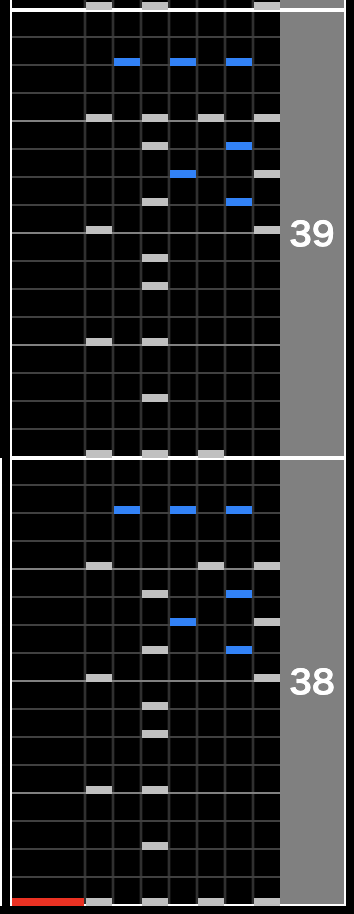

どうもヒロです。今回はタイトルの通り、七段に受かったので六段から七段になるまでの過程やこれをやっておけば良かったと思う事、これをしなければ良かった事などまとめて行きたいと思います。

## 六段から七段になるまでの期間

こちらのツイートの投稿日を見ると

https://twitter.com/hirodeath/status/1286131899421753347?s=20

2020 年 7 月 23 日に六段になりました。そして本日が 2020 年 12 月 29 日なので 5 ヶ月と 6 日、日数にすると 159 日で七段になる事が出来ました。

beatmania を始めたのが 2020 年 4 月 9 日からなので beatmania を始めてから六段になるよりも六段から七段になる方が遥かに時間がかかっています。ちなみに少し話しはそれますが、最近 infinitas 段位の七段を飛び級して八段に受かろうと試行錯誤しています。というのも infinitas の七段と八段はそんなに難易度に幅があるようには感じなかったのでこういう飛び級出来そうと思えました。AC だとどうしても V2 と s!ck が強過ぎて難しいと思わざるを得ない感じがしています。

https://twitter.com/hirodeath/status/1343030085981335553?s=20

とはいえ infintias 八段は gigadelic sph が課題曲に入っていて、最後の 67 トリルがめちゃくちゃ難しく、なんとか突破出来そうで出来ない、まさに the safari の時みたいな感じになっていて、癖付いたりしないかなと心配しています。

## やって良かった事

以下やって良かった事を簡潔にまとめます。

- ランプ埋めをした事
- BMS、AC、infinitas と 1 つに固執せずにプレイ出来た事
- 自分の地力に合わせてなるべく低難易度をやらないようにした事

が挙げられます。

### ランプ埋めをした事

これは主に infinitas に関してですが、AC と infintias をプレイする割合は大体 1:10 もしくは 2:10 ぐらいの割合で infinitas です。つまり AC はあまりやらず殆ど infintias ばっかりやっています。なので目標を立てるのも必然的に infintias を中心に日々の目標、週間目標などを立てる事が多いです。

その中で例えば

- ☆9 全曲ノマゲする
- ☆10 のハードを合計で 20 曲以上にする
- ☆11 のアシストイージー以上クリア合計を 50 曲以上にする

など目標をざっくりでも良いので立て、日々プレイする際に意識してやるようにしていました。漠然とプレイするよりも目先の目標が定まっていると選曲時間が短くなったり、より集中してプレイ出来たり、ランプが埋まらず(イージー、ノマゲなど上位ランプを取る事も含む)何回も同じ曲をプレイして結局ランプが埋まらないみたいなスランプにもハマりにくい印象がありました。というのもその狙った 1 曲でランプ埋まらなくとも他にも挑戦して出来そうな曲あるしそのうちランプ埋まるだろうと良い意味で気を抜いてプレイ出来ました。

### BMS、AC、infinitas と 1 つに固執せずにプレイ出来た事

これ良かった事に書いてますが今の所まだそんなに強い恩恵を受けていません。ずっと infintias やってて週 1 ぐらいで AC やったりたまに BMS で GENOCIDE2018 の段位受けたり第二通常や satellite の sl0 などをプレイすると新鮮味があったりしますが、そんなに活かせていません。でも選択肢があって良かったなと感じる事はありました。

### 自分の地力に合わせてなるべく低難易度をやらないようにした事

なるべく低難易度をやらずに自分の地力に合わせたギリギリの曲をプレイする、というのは本当に大事な事だと思います。例えば段位六段のプレイヤーと言っても

- ☆9 をメインにプレイをしているプレイヤー
- ☆9-10 をメインにプレイをしているプレイヤー
- ☆10-11 をメインにプレイをしているプレイヤー

など、同段位内でも地力に差があったりすると思います。なので六段で七段目指すならこれをしろというのは決めつけ難いんじゃないかと思いますが、一つ強く推奨出来るのは自分の地力ギリギリの譜面をたくさんプレイして自分の上限値を無理矢理伸ばし続けた先に成長があるんじゃ無いかなと思います。

僕は自分の地力上限値を上げる為に AA(sph)をランダムでプレイするという事を定期的に行っていましたが、最初はアシストイージーすら付きませんでした。結果的に infinitas でノマゲまで出来るようになりましたが、AA(sph)を出来るようになるまでに heavenly sun(SPA)などを良くやっていました。

他にも色々やっていた記憶がありますがさらに上位のクリアランプを付ける事を日々の目標にし、出来なくてもいつか出来るという気持ちの緩さを保ちつつ、とにかく数をこなすようにし、定期的に皿の練習、乱打の練習、同時押しの練習、昔の曲の練習(high や ACT、tomorrow perfume、quicking など)を定期的に取り入れて練習していました。しかしどれも絶対に毎日やるなど決めずにとにかくランプ埋めだけは集中してやるみたいな感じでやっていました。

## やらなくても良かった事

以下同様に簡潔にまとめて深掘りします。

- 段位を受け過ぎる事(the safari を正規ミラーでやり過ぎる事)
- ランダム常備でプレイする事
- 低難易度エクハ埋めにこだわった事
- 時間を大切に出来なかった事

### 段位を受け過ぎる事(the safari を正規ミラーでやり過ぎる事)

これは癖が付いてしまうからです。当たり前ですよね？でもきっと多くの人(僕も含め)段位は受け過ぎると癖が付くからやり過ぎない方が良いとわかっていてもたくさんやってしまうと思います。特に友人知人が同段位で先に七段になって焦って自分も早く受かりたいと思ってしまったり、課題曲 2-3 曲目が 90%ぐらいで通過出来るて the safari 序盤で大体 90%維持でテレテレ地帯に挑めるってなったら何回でも挑戦したくなると思います。

ミラー段位もあるので正規がダメならミラー、ミラーがダメなら正規と切り替えてプレイする事で癖を付きにくく出来るかもしれませんがそれでも段位課題曲はあまりやらない方が良かったと思います。特に the safari は正規ミラーで練習しない方が良かったし、段位受け過ぎたと思いました。

### ランダム常備でプレイする事

これは大体六段ぐらいからランダム常備してプレイすると良いと言われる事がありますが、正直ランダム常備に拘ってプレイしなくても七段取れます。あと多分八段もランダム常備に拘らなくても取れると思います。少なくとも infintias 八段はランダム常備に拘らなくても取れます。と infinitas 六段、ビストロ七段の自分が言っても説得力無いと思いますが、ランダムを絶対常備は何か違うのでは無いかと思います。

もちろん場合によってランダムを使うのはありと思います。例えば ☆9 の high などは

### 低難易度エクハ埋めにこだわった事

infintias では楽曲解禁の条件に ☆1 以上の難易度で AA 以上を取得するなどの条件が複数あります。そういったスコアランク A 以上、AA 以上、AAA 以上などの条件を達成する為にという前提で ☆5 の全エクハ埋めをしたりしていました。結果的に全部エクハで埋まって良かったなと思いましたが、低難易度のエクハ埋めは積極的にやる必要は無かったかもなと思います。特に AC でなら尚更気が向いたらエクハ少し埋めるかぐらいでやるのは良いと思いますが、積極的にエクハを埋める必要は無いと思います。

### 時間を大切に出来なかった事

これは今も時々抱えている事ですが、僕は基本的に朝 infintias をやる事が多いです。しかし、例えば寝る時間が遅く朝早くに起きれなかったり、起きれたとしてもダラダラしてプレイ出来たであろう時間を食い潰してしまったりしてしまう事が多々ありました。

結婚しているから、という理由で一括りにしたくは無いけど自分の時間を全て自分に使うのが難しく、そもそも集中して infintias をやる時間を確保するのが難しいと感じる時が多々あったりしました。  
集中せず、惰性でプレイしても成長しにくいと考えていますが、練習する際の集中の質を落とさずにプレイする為にも事前にこの時間からこの時間は最低でも集中してプレイするなどマイルールを厳格にして置くべきだったと感じています。そしてこれは今後の課題でもあります。

## 僕が思うビストロ七段通過目安

infinitas 基準で申し訳ないですが、僕がビストロ七段を通過した際のランプ状況は以下でした。

- ☆1-5 は全曲エクハ以上、☆6 全ハード以上、☆7 は advance 以外全ハード、☆8 未ハード 10 曲
- ☆9 全曲ノマゲ以上、うち半分以上がハード済み
- ☆10 未クリア 9-10 曲、ハード 30 曲ぐらい
- ☆11 大体 70 曲以上アシストイージー

でした。そのうち大分前の段階で the safari 開始時のゲージが 80%以上で挑めていたので実際はどれだけ the safari が出来るかによって変わってくると思っています。なので例えば ☆9 全ノマゲが七段通過目安とは思っていません。例えば ☆9 未クリアが例えあったとしても、☆10 にハードが付かなかったとしても、☆11 を 1 曲もクリアしていなかったとしても the safari のテレテレ地帯が対応出来れば verflucht で多少余裕を持たせてクリア出来るぐらいで十分なのかもしれません。

僕の場合は昔の曲でありがちな同時が 16 分で連続で配置されていたり、縦連だったりが苦手でした。例えば high や ACT、Cyber Force、LAB、quicking、250BPM などです。こういう昔の譜面で独特なリズムの楽曲は本当に苦手でした。今でも完全に克服したかと言われると怪しいですが、ランダムでプレイして大分押せるようになりました。

またこれらの楽曲を六段になってから早めに練習に取り入れていたらもしかしたらもっと早く七段になっていたかもとすら思います。これらの楽曲をランダムでプレイすると the safari の練習になると思います。

## 葛藤

ここからは自分が六段になってから七段になるまでに抱いていた感情をつらつら書いて行きたいと思います。

Heroic Verse(以下 HV)の時点で課題曲 1-2 曲目をゲージ 100%クリアしたにも関わらず、StrayedCatz の高速 3 連が押せずに HV では 1 度も the safari に到達した事がありませんでした。今思うとゲージギリギリで瀕死の状態で the safari に挑んでも結局 the safari 難民状態から抜け出す事は出来なかったと思います。そしてビストロ寺が稼働し、段位 1-3 曲目までガラッと代わり、なんと 3 曲目に Verflucht 灰が来ました。既に Verflucht 灰をノマゲしていたのでこれでやっと the safari に挑めると思っていました。結果ちゃんと挑めるようになったのですが、結局後半縦連テレテレでゲージ落ちする日々が始まるだけでした。

地力を上げても上げても後半縦連テレテレで段位落ちする日々が段位合格するまで 2 ヶ月続きました。その間に infintias でですが Verflucht 灰はハードし、☆11 クリア済みの楽曲数が日に日に増えて行き、☆11 でノマゲやハード出せるようになったりなどしました。段位合格までに the safari は乱でイージー、AA 灰はノマゲまで出来るようになりました。

基本 67 トリルが苦手過ぎたのでミラー段位で受けていましたが、ミラー段位でも癖が付き、何度やってもダメな日々が続きました。週に 1 回段位を受けていましたが、ほぼ毎週同じ箇所でゲージ落ちしていて精神的にキツかったです。なんで地力は上がっているのでいつまで経っても同じ所でゲージ落ちしているんだと。

もちろん厳しい言葉や色々な提案を受けました。。the safari の最後の 1 鍵叩くまでが七段だと、七段飛ばして八段目指したらどうかと。このまま七段を受け続けるのはどうなのか、それとも八段を目指して頑張った方が良いのか、s!ck を押せるようになるのか？など悩みました。

そう悩んでいるうちにたまたま 1 回 infinitas 八段を受けたら課題曲 4 曲目の gigadelic の最後の 67 トリルまで押せる事が出来ました。気のせいかと思ってもう 1 回やったら同じ所で落ちました。さらに日にちを少し空けて再度挑戦したら同じ箇所でまた落ちました。そこで気付きました。infinitas は無理に七段受ける必要は無い、飛び級しようと。

そうなった場合、infinitas も飛び級した方が良いのだろうかと悩んでいて、たまたま 1 回七段を受けたら the safari の最後のノーツが少ないテレテレの部分でゲージ落ちしました。これは行けるのではないか？と思ってもう一度やった所、、、七段に受かる事が出来ました。

月日で見たら 5 ヶ月で、人によっては短い期間にも長い期間にも捉えられると思います。ただ僕の中ではある種傲慢ですがもっと早い段階で行けたんじゃないかと思っています。結果として七段に受かれたから良かったですが、長く苦しい時間だったと思います。主な苦しさの原因は自分の中で地力が上がっている実感を毎週味わっていて日々上手くなっているとランプやスコアの面でも精神的にも実感しているのに段位受ける度に同じ部分で何度も何度も 2 ヶ月間同じ箇所でゲージ落ちしていた事です。本当に苦しかった。例えば 2 曲目の Flashback すらまともに押せず、ゲージ落ちしてしまっていたかもとかの状態から Flashback 安定してゲージ 30%残せる、verflucht 終了時ゲージ 30%残せる、40%残せる、50%、60%...

などどんどん押せるようになった後にやっと七段に受かったなら恐らく苦しさはもっと優しい物になっていたと思います。何度も書きますが明らかに成長していると実感しているのに約 2 ヶ月の間ずっと同じ箇所でゲージ落ちしていて the safari ミラー段位という点に関して成長を感じ辛かった(変わっていないように感じた)のが本当に辛かったです。

この状態が癖が付いたという状態なのか、それとも単純に後半縦連テレテレを押せる地力が付かなかったのかは謎ですが、あんまり段位は受けない方が良いというのは事実だと思います。

少し技術的な話しになりますが、テレテレの部分(以下画像は正規で後半縦連テレテレの画像です)の 67 トリルをしっかり意識してテレテレテのこの 16 分 5 連打目をしっかり 57 の同時押しを右手で取るように意識し出してから見えるようになり始めた気がします。

後半縦連テレテレの最初の 2 小説

ミラーなので僕の場合は実際 123 鍵ですが、普段僕は 1048 式 + 3:5 半固定でプレイしているのでテレテレの所を見てわかる通り皿がありません。なので左手側が何をどう押すかをしっかり認識した上で右手も取りに行くイメージを持てるようになってから少しずつ縦連テレテレの苦手意識が無くなって来ました。

## 最後に

ほぼ僕の感想葛藤文でしたが、気持ちを全部吐き出せてスッキリしました。年越してしまい、明日から通常業務再開ですがやっと前向きに八段に挑戦出来そうです。これからもガンガン成長して行くぞ！！！
